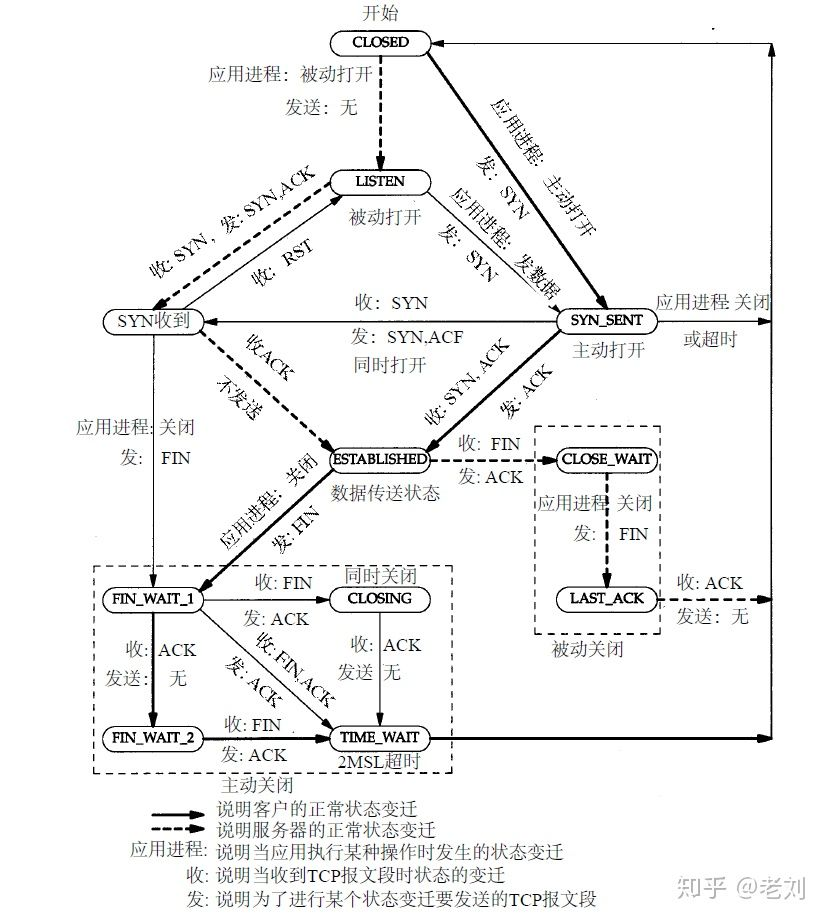

# TCP

## Socket 5元组
1. 源IP
2. 源端口
3. 目的IP
4. 目的端口
5. 类型：TCP:UDP

例：

```
访问百度的时候，socket五元组可能是：

    [180.172.35.150:45678, tcp, 180.97.33.108:80]
```

## 三次握手

```
client                       server
SYN_SEND    |------SYN---->| 
            |<---SYN ACK---| SYN_REVD
ESTABLISHED |------ACK---->| ESTABLISHED
```
1. 客户端给服务端发一个 SYN 报文，并指明客户端的初始化序列号 ISN©。此时客户端处于 SYN_SEND 状态
    * 首部的同步位SYN=1，初始序号seq=x，SYN=1的报文段不能携带数据，但要消耗掉一个序号。
2. 服务器收到客户端的 SYN 报文之后，会以自己的 SYN 报文作为应答，并且也是指定了自己的初始化序列号 ISN(s)。同时会把客户端的 ISN + 1 作为ACK 的值，表示自己已经收到了客户端的 SYN，此时服务器处于 SYN_REVD 的状态
    * 确认报文段中SYN=1，ACK=1，确认号ack=x+1，初始序号seq=y
3. 客户端收到 SYN 报文之后，会发送一个 ACK 报文，当然，也是一样把服务器的 ISN + 1 作为 ACK 的值，表示已经收到了服务端的 SYN 报文，此时客户端处于 ESTABLISHED 状态。服务器收到 ACK 报文之后，也处于 ESTABLISHED 状态，此时，双方已建立起了连接
    * 确认报文段ACK=1，确认号ack=y+1，序号seq=x+1（初始为seq=x，第二个报文段所以要+1），ACK报文段可以携带数据，不携带数据则不消耗序号。

#### ISN(Initial Sequence Number)初始序号

当一端为建立连接而发送它的SYN时，它为连接选择一个初始序号。ISN随时间而变化，因此每个连接都将具有不同的ISN。ISN可以看作是一个32比特的计数器，每4ms加1

#### 三次握手过程中可以携带数据吗

第三次握手的时候，是可以携带数据的。但是，第一次、第二次握手不可以携带数据

防止在第一次握手中的 SYN 报文中放入大量的数据来进行攻击

#### SYN攻击

SYN攻击就是Client在短时间内伪造大量不存在的IP地址，并向Server不断地发送SYN包，Server则回复确认包，并等待Client确认，由于源地址不存在，因此Server需要不断重发直至超时，这些伪造的SYN包将长时间占用未连接队列，导致正常的SYN请求因为队列满而被丢弃，从而引起网络拥塞甚至系统瘫痪。SYN 攻击是一种典型的 DoS/DDoS 攻击

检测syn攻击的方法

    netstat -n -p TCP | grep SYN_RECV

常见的防御SYN攻击的方法

* 缩短超时（SYN Timeout）时间
* 增加最大半连接数
* 过滤网关防护
* SYN cookies技术

## 四次挥手

```
client                       server
FIN_WAIT1   |------FIN---->| 
            |<-----ACK-----| CLOSE_WAIT
FIN_WAIT2   |<---FIN ACK---| LAST_ACK
TIME_WAIT   |------ACK---->| CLOSED
```

1. 客户端发送一个 FIN 报文，报文中会指定一个序列号。此时客户端处于 FIN_WAIT1 状态。
    * 发出连接释放报文段（FIN=1，序号seq=u），并停止再发送数据，主动关闭TCP连接，进入FIN_WAIT1（终止等待1）状态，等待服务端的确认。
2. 服务端收到 FIN 之后，会发送 ACK 报文，且把客户端的序列号值 +1 作为 ACK 报文的序列号值，表明已经收到客户端的报文了，此时服务端处于 CLOSE_WAIT 状态。
    * 服务端收到连接释放报文段后即发出确认报文段（ACK=1，确认号ack=u+1，序号seq=v），服务端进入CLOSE_WAIT（关闭等待）状态
    * 此时的TCP处于半关闭状态，客户端到服务端的连接释放
    * 客户端收到服务端的确认后，进入FIN_WAIT2（终止等待2）状态，等待服务端发出的连接释放报文段
3. 如果服务端也想断开连接了，和客户端的第一次挥手一样，发给 FIN 报文，且指定一个序列号。此时服务端处于 LAST_ACK 的状态
    * 服务端发出连接释放报文段（FIN=1，ACK=1，序号seq=w，确认号ack=u+1），服务端进入LAST_ACK（最后确认）状态，等待客户端的确认
4. 客户端收到 FIN 之后，一样发送一个 ACK 报文作为应答，且把服务端的序列号值 +1 作为自己 ACK 报文的序列号值，此时客户端处于 TIME_WAIT 状态。需要过一阵子以确保服务端收到自己的 ACK 报文之后才会进入 CLOSED 状态，服务端收到 ACK 报文之后，就处于关闭连接了，处于 CLOSED 状态
    * 客户端收到服务端的连接释放报文段后，对此发出确认报文段（ACK=1，seq=u+1，ack=w+1），客户端进入TIME_WAIT（时间等待）状态
    * 此时TCP未释放掉，需要经过时间等待计时器设置的时间2MSL后，客户端才进入CLOSED状态
    * 客户端执行主动关闭并进入TIME_WAIT是正常的
    * 服务端通常执行被动关闭，不会进入TIME_WAIT状态

### 挥手为什么需要四次

* 当服务端收到客户端的SYN连接请求报文后，可以直接发送SYN+ACK报文。其中ACK报文是用来应答的，SYN报文是用来同步的

* 关闭连接流程中，当服务端收到FIN报文时，很可能并不会立即关闭SOCKET，所以只能先回复一个ACK报文，告诉客户端，“FIN报文收到了”。只有等到服务端所有的报文都发送完了，才能发送FIN报文，因此不能一起发送，故需要四次挥手。

### 2MSL等待状态

* TIME_WAIT状态也成为2MSL等待状态
* 每个具体TCP实现必须选择一个报文段最大生存时间MSL（Maximum Segment Lifetime），它是任何报文段被丢弃前在网络内的最长时间
* 这个时间是有限的，因为TCP报文段以IP数据报在网络内传输，而IP数据报则有限制其生存时间的TTL字段

* 当TCP执行一个主动关闭，并发回最后一个ACK，该连接必须在TIME_WAIT状态停留的时间为2倍的MSL。这样可让TCP再次发送最后的ACK以防这个ACK丢失（另一端超时并重发最后的FIN）
* 这个TCP连接在2MSL等待期间，定义这个连接五元组不能再被使用。这个连接只能在2MSL结束后才能再被使用。

### 四次挥手释放连接时，等待2MSL的意义

* 保证客户端发送的最后一个ACK报文段能够到达服务端。
* 防止“已失效的连接请求报文段”出现在本连接中。


## TIME_WAIT 和 CLOSE_WAIT

关闭socket需要通过四次挥手来完成
* 主动关闭连接的一方，调用close()；协议层发送FIN包
* 被动关闭的一方收到FIN包后，协议层回复ACK；然后被动关闭的一方，进入CLOSE_WAIT状态，主动关闭的一方等待对方关闭，则进入FIN_WAIT_2状态；此时，主动关闭的一方 等待 被动关闭一方的应用程序，调用close操作
* 被动关闭的一方在完成所有数据发送后，调用close()操作；此时，协议层发送FIN包给主动关闭的一方，等待对方的ACK，被动关闭的一方进入LAST_ACK状态；
* 主动关闭的一方收到FIN包，协议层回复ACK；此时，主动关闭连接的一方，进入TIME_WAIT状态；而被动关闭的一方，进入CLOSED状态
* 等待2MSL时间，主动关闭的一方，结束TIME_WAIT，进入CLOSED状态

结论
1. 主动关闭socket一方会进入TIME_WAIT状态
2. 被动关闭连接的一方会进入CLOSE_WAIT的中间状态，需要应用程序调用close
3. TIME_WAIT默认等待2MSL后才能进去CLOSED状态
4. 一个连接在进入CLOSED状态之前无法被重用

### TIME_WAIT 作用

TIME_WAIT是为了解决网络丢包和网络不稳定带来的其他问题：

1. 防止前一个连接上延迟的数据包或丢失重传的数据包被复用的连接接收
2. 确保连接方能在时间范围内关闭自己的连接【也是防止丢包】
```
* 主动关闭方关闭了连接，发送了FIN；
* 被动关闭方回复ACK同时也执行关闭动作，发送FIN包；此时，被动关闭的一方进入LAST_ACK状态
* 主动关闭的一方回去了ACK，主动关闭一方进入TIME_WAIT状态；
* 但是最后的ACK丢失，被动关闭的一方还继续停留在LAST_ACK状态
* 此时，如果没有TIME_WAIT的存在，或者说，停留在TIME_WAIT上的时间很短，则主动关闭的一方很快就进入了CLOSED状态，也即是说，如果此时新建一个连接，源随机端口如果被复用，在connect发送SYN包后，由于被动方仍认为这条连接【五元组】还在等待ACK，但是却收到了SYN，则被动方会回复RST
* 造成主动创建连接的一方，由于收到了RST，则连接无法成功
```

### 为什么TIME_WAIT状态会持续2MSL（2倍的max segment lifetime）

RFC 793中定义了TIME_WAIT状态持续2MSL。 

用于确保最后丢失了ACK时，被动关闭的一方再次重发FIN并等待回复ACK一来一去的两个来回。

内核中写死了MSL时间为30秒。（RFC中建议的MSL时间是2分钟）

### TIME_WAIT过多带来的问题

通过 `ss -tan state time-wait | wc -l `查看TIME_WAIT数量

1. 占用内存
    * 内核里使用一个hash table保存所有连接
    * 还有一个hash table用来保存所有的bound ports
2. 消耗CPU
    * 寻找随机端口时需要遍历bound ports

一万条TIME_WAIT大概消耗1M左右的内存

### TIME_WAIT调优

```
打开 sysctl.conf 文件，修改以下几个参数：

net.ipv4.tcp_tw_recycle = 1

net.ipv4.tcp_tw_reuse = 1

net.ipv4.tcp_timestamps = 1
```

1. net.ipv4.tcp_timestamps
    * RFC 1323 在TCP Reliability一节中引入了timestamp的TCP option——两个4字节的时间戳字段，第一个4字节字段用来保存发送该数据包的时间，第二个4字节字段用来保存最近一次接受到对方数据的时间。
    * tcp_tw_reuse和tcp_tw_recycle依赖该字段

2. net.ipv4.tcp_tw_reuse
    * 复用TIME_WAIT状态的连接
    * 只有主动关闭连接的一方再次向对方发起连接请求的时候才能复用TIME_WAIT状态的连接
    * 适用于某一方不断地通过短连接连接其他服务器的场景。总是自己先关闭连接，关闭后又不断重新连接对方
    * 复用连接后这条连接的时间被更新为当前的时间，内核根据收到数据中的timestamp是否小于当前连接中的timestamp来判断是否是延迟数据
    * 该配置需要连接双方同时支持net.ipv4.tcp_timestamps，且这个配置仅影响outbound连接（作为客户端的角色）

3. net.ipv4.tcp_tw_recycle
    * 开启后内核会快速回收TIME_WAIT状态的socket连接
    * 不再是2MSL，而是1RTO（retransmission timeout，数据包重传的timeout时间，），RTO根据RTT动态计算得出，远小于2MSL
    * 开启该配置后内核会记录TIME_WAIT socket的统计数据，包括最近一次收到数据包时间。晚于该时间的数据包会被丢掉
    * 该配置需要连接双方同时支持net.ipv4.tcp_timestamps，且这个配置仅影响inbound连接，作为服务端的角色主动关闭连接时，快速回收状态处于TIME_WAIT状态的socket

## TCP状态变迁图

如下图所示，粗的实线箭头表示正常的客户端状态变迁，粗的虚线箭头表示正常的服务器状态变迁



## 资料
[面试官，不要再问我三次握手和四次挥手](https://zhuanlan.zhihu.com/p/86426969)

[系统调优，你所不知道的TIME_WAIT和CLOSE_WAIT](https://mp.weixin.qq.com/s/8WmASie_DjDDMQRdQi1FDg])
